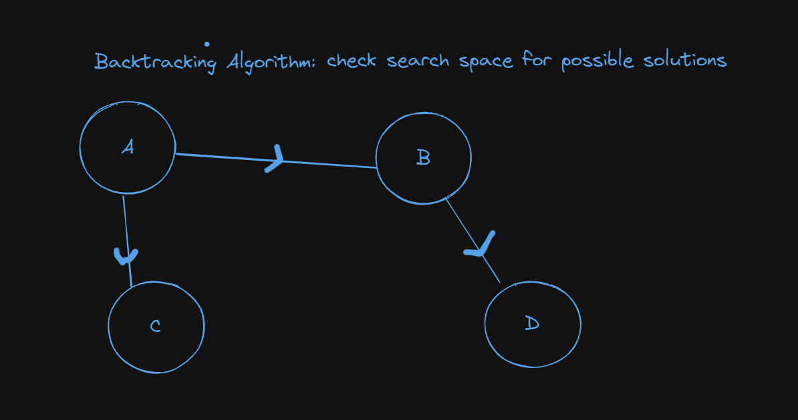

# Constraint Satisfaction Problem

## By: 
1. [Rishi Viswanathan](https://github.com/risv1) - RA2211028010109 
2. [Kaushik Iyer](https://github.com/CursedFyre) - RA2211028010113
3. [Harsh Patel](https://github.com/HarshPatel5940) - RA2211028010127

## Description

 - A CSP involves finding solutions to a problem where variables must satisfy certain constraints. Based on DFS.
 - CSPs are represented by a set of variables, a scope for each variable, and constraints that specify allowable combinations of values for sets of variables.
 - This Python program implements Constraint Satisfaction through means of assigning unique number values to each variable from the given domain.

## Backtracking Algorithm Flow

[Drive](https://docs.google.com/presentation/d/1NPTTu7UH8YUTbqv_n3bJAA0rGuIpYHG09O8kk8t6pHk/edit#slide=id.p1)
